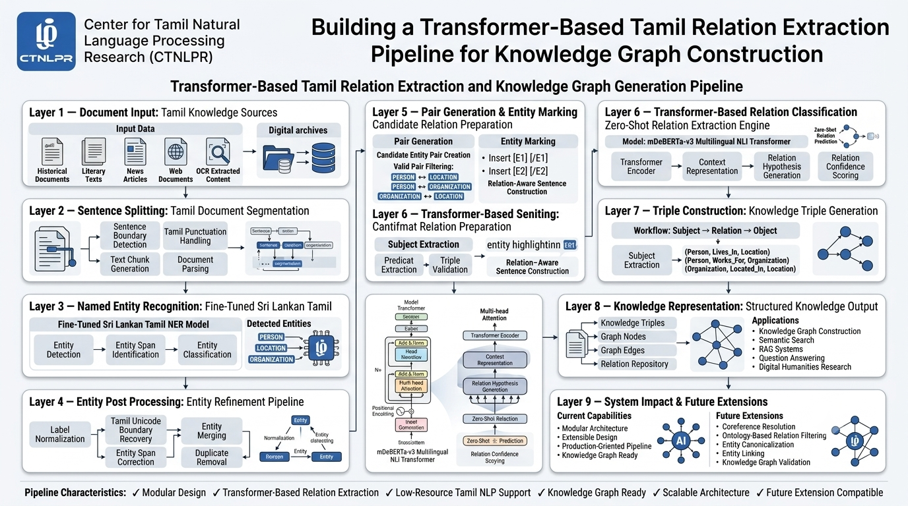

# Tamil Relation Extraction Pipeline

## Overview

This project implements a **Transformer-Based Relation Extraction (RE) Pipeline** for Tamil text. The system extracts structured knowledge triples from unstructured Tamil documents by combining Named Entity Recognition (NER), Entity Pair Generation, Relation Classification, and Triple Construction.

The extracted output follows the format:

```text
(Subject, Predicate, Object)
```

Example:

```text
Input:
சாம்பசிவம் யாழ்ப்பாணத்தில் வாழ்ந்தார்.

Output:
(சாம்பசிவம், LIVED_IN, யாழ்ப்பாணத்தில்)
```

Relation Extraction is a core Information Extraction task that identifies semantic relationships between entities and converts unstructured text into machine-readable knowledge. It is commonly used in Knowledge Graph construction, Question Answering, and Knowledge Base Population systems. 

---

# Architecture

Current pipeline follows a standard pipeline-based Information Extraction architecture:



```text
Document
    ↓
Sentence Splitter
    ↓
Named Entity Recognition (NER)
    ↓
Entity Post Processing
    ↓
Pair Generation
    ↓
Entity Marker
    ↓
Relation Extraction
    ↓
Triple Builder
    ↓
Knowledge Triples
```

Pipeline-based architectures first identify entities and then classify relations between entity pairs. This approach is widely used because it provides modularity and easier debugging. 

---

# Project Structure

```text
Relation_extraction_v1/
│
├── domain/
│   ├── entity.py
│   ├── entity_pair.py
│   ├── relation_prediction.py
│   └── triple.py
│
├── models/
│   ├── ner/
│   │   └── ner_model.py
│   │
│   └── relation/
│       └── relation_model.py
│
├── pipeline/
│   ├── sentence_splitter.py
│   ├── ner_stage.py
│   ├── pair_generator.py
│   ├── entity_marker.py
│   ├── relation_stage.py
│   ├── triple_builder.py
│   └── extraction_pipeline.py
│
├── schemas/
│   └── relation_schema.py
│
├── utils/
│   ├── entity_postprocessor.py
│   ├── entity_merger.py
│   └── label_mapper.py
│
├── tests/
│
├── tests_manual/
│
└── evaluation/
```

---

# Components

## 1. Sentence Splitter

Splits a document into individual Tamil sentences.

Example:

```text
Input:
சாம்பசிவம் யாழ்ப்பாணத்தில் வாழ்ந்தார்.
அவர் ஆசிரியராக பணியாற்றினார்.

Output:
[
  "சாம்பசிவம் யாழ்ப்பாணத்தில் வாழ்ந்தார்.",
  "அவர் ஆசிரியராக பணியாற்றினார்."
]
```

---

## 2. Named Entity Recognition (NER)

Uses the fine-tuned model:

```text
exentai/SriLankan_Tamil_NER
```

Recognized entity types:

```text
PERSON
LOCATION
ORGANIZATION
```

Example:

```text
Sentence:
சாம்பசிவம் யாழ்ப்பாணத்தில் வாழ்ந்தார்.

Entities:
PERSON      → சாம்பசிவம்
LOCATION    → யாழ்ப்பாணத்தில்
```

Named Entity Recognition identifies mentions of people, organizations, and locations from raw text and serves as the foundation of most information extraction pipelines. 

---

## 3. Entity Post Processing

Performs:

### Label Normalization

```text
PER → PERSON
LOC → LOCATION
ORG → ORGANIZATION
```

### Tamil Boundary Recovery

Fixes tokenizer boundary issues for Tamil Unicode characters.

Example:

```text
Before:
சாம்பசிவம

After:
சாம்பசிவம்
```

### Entity Merging

Combines fragmented entities.


---

## 4. Pair Generation

Generates candidate entity pairs.

Allowed combinations:

```python
ALLOWED_ENTITY_PAIRS = {
    ("PERSON", "LOCATION"),
    ("PERSON", "ORGANIZATION"),
    ("ORGANIZATION", "LOCATION")
}
```

Example:

```text
PERSON       → சாம்பசிவம்
LOCATION     → யாழ்ப்பாணத்தில்

Generated Pair:
(சாம்பசிவம், யாழ்ப்பாணத்தில்)
```

---

## 5. Entity Marker

Adds entity markers required by the relation classifier.

Example:

```text
Original:
சாம்பசிவம் யாழ்ப்பாணத்தில் வாழ்ந்தார்.

Marked:
[E1] சாம்பசிவம் [/E1]
[E2] யாழ்ப்பாணத்தில் [/E2]
வாழ்ந்தார்.
```

---

## 6. Relation Extraction

Uses:

```text
MoritzLaurer/mDeBERTa-v3-base-xnli-multilingual-nli-2mil7
```

Zero-shot NLI-based relation classification.

Candidate relations:

```text
LIVED_IN
WORKED_AT
CONTRIBUTED_TO
PART_OF
BORN_IN
```

Relation extraction identifies and classifies semantic relationships between recognized entities. 

---

## 7. Triple Builder

Converts predictions into Knowledge Graph triples.

Example:

```text
Entity Pair:
(சாம்பசிவம், யாழ்ப்பாணத்தில்)

Predicted Relation:
LIVED_IN

Output:
(
  சாம்பசிவம்,
  LIVED_IN,
  யாழ்ப்பாணத்தில்
)
```

Triple extraction transforms unstructured text into structured knowledge representations suitable for Knowledge Graphs. 

---

# Running the Pipeline

Example:

```python
from pipeline.extraction_pipeline import (
    ExtractionPipeline
)

pipeline = ExtractionPipeline()

document = """
சாம்பசிவம் யாழ்ப்பாணத்தில் வாழ்ந்தார்.
"""

triples = pipeline.run(document)

for triple in triples:
    print(triple)
```

Output:

```text
Triple(
    subject='சாம்பசிவம்',
    predicate='LIVED_IN',
    object='யாழ்ப்பாணத்தில்'
)
```

---

# Current Status

### Completed

* Sentence Splitting
* NER Integration
* Entity Post Processing
* Pair Generation
* Entity Marker
* Transformer-based Relation Extraction
* Triple Builder
* End-to-End Pipeline
* Unit Tests
* Manual Tests

### Planned

* Coreference Resolution
* Relation Confidence Filtering
* Evaluation Dataset
* Knowledge Graph Export
* Ontology-Based Relation Validation
* Multi-Sentence Relation Extraction

---

# Future Architecture

```text
Document
    ↓
Sentence Splitter
    ↓
NER
    ↓
Coreference Resolution
    ↓
Entity Post Processing
    ↓
Pair Generation
    ↓
Relation Extraction
    ↓
Relation Filtering
    ↓
Triple Builder
    ↓
Knowledge Graph
```

This future design will reduce error propagation and improve document-level relation extraction across multiple sentences.

